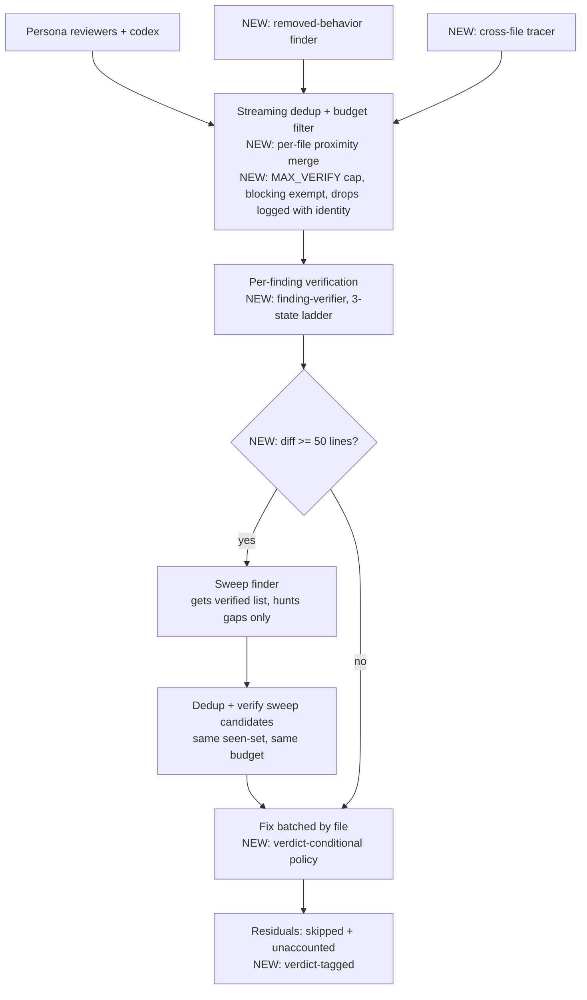

# feat: Import built-in code-review mechanisms into the Quality phase

## Summary

Upgrade the Quality phase of `workflows/nadia-deliver.js` with five mechanisms from Claude Code's built-in workflow-backed `/code-review`: a 3-state recall-biased verdict ladder, two mechanistic finder angles, proximity-based dedup, a severity-aware verify budget with logged drops, and a gap-hunting sweep pass. The fix-and-residual loop, codex second-model reviewer, and risk-surface persona activation stay unchanged.

---

## Problem Frame

Nadia's Quality phase shares the built-in reviewer's spine (parallel reviewers → per-finding adversarial verification → dedup → fix) but is precision-biased where the built-in argues for recall: the `skeptical-refuter` defaults to *refuted when uncertain*, silently discarding the "mechanism real, trigger uncertain" class (races, rare-path nils, boundary off-by-ones) that ships bugs. Its dedup fingerprint (`file::line::title` exact match) fails to merge the same defect reported at ±2 lines or under a different title. Verifier spawns are unbounded, findings carry no concrete failure scenario, no pass hunts for what the first reviewers missed, and no roster procedure audits removed behavior or traces callers of changed functions. The built-in `/code-review` (extracted from the CLI binary, v2.1.170) solves each of these; this plan ports those mechanisms while keeping nadia's advantages the built-in lacks — closing the loop with fixers and residuals, and a second model family in the roster.

---

## Requirements

**Verification**

- R1. Finding verification returns one of CONFIRMED / PLAUSIBLE / REFUTED under the recall-biased rubric (PLAUSIBLE by default for realistic runtime states; REFUTED only when constructible from the code). Only REFUTED findings are dropped.
- R2. PLAUSIBLE and CONFIRMED findings both reach the fixer under a verdict-conditional policy: CONFIRMED is fixed unless provably wrong; PLAUSIBLE is fixed only when the fix is local and behavior-preserving, otherwise skipped with the verifier's what-would-confirm-it note as the reason.
- R3. Verifier spawns are capped with severity awareness: blocking-severity findings are exempt from the cap (the fixed roster bounds them); suggested-severity findings dropped by the cap are counted, logged with identity (file:line — title), and reported in the workflow result — never silently truncated.
- R11. Residual entries and PR-body residual lines carry the finding's verdict, and kept-finding counts in the workflow result are split by verdict — a PR triager can distinguish "confirmed bug we could not fix" from "plausible candidate the fixer declined".

**Finding**

- R4. The reviewer roster always includes two mechanistic angle finders: a removed-behavior auditor and a cross-file tracer.
- R5. Every reviewer finding carries a concrete `failure_scenario` (inputs/state → wrong outcome); for cleanup-style findings it states the concrete cost instead of a crash. The coordinator schema and the copy embedded in `agents/codex-reviewer.md` stay in sync.
- R6. Reviewers pass every candidate with a nameable failure scenario through to verification rather than silently dropping half-believed candidates.

**Aggregation**

- R7. Cross-reviewer dedup merges findings in the same file within ±2 lines (title-prefix fallback when no usable line); findings at clearly distinct locations are never collapsed. Merge keeps the higher severity and credits all reporting personas.
- R8. When the integration diff is ≥ 50 changed lines, a sweep finder receives the verified-findings list and hunts only for gaps; its candidates face the same verification and budget, and join the fix set.

**Preservation and coverage**

- R9. Existing Quality-phase behavior outside the five mechanisms is preserved: simplify gate, persona activation from risk surfaces, codex circuit breaker, halt paths, fix batching by file, residual recording.
- R10. The simulation suite covers each new behavior with at least one scenario per mechanism.

---

## Key Technical Decisions

- **New `agents/finding-verifier.md` persona; `skeptical-refuter` untouched.** The refuter's binary default-refuted contract is the right tool for claim verification (refutation-majority panels per `docs/workflows/patterns.md`); rewriting its polarity in place would silently change every other call site's semantics. The Quality phase switches its verify stage to the new persona. Registry caveat: the new persona resolves via `agentType` only in a session started after the file exists — acceptable because nothing dispatches it until the improved workflow's next run.
- **PLAUSIBLE goes to the fixer under a verdict-conditional policy.** The fixer's existing skip trigger ("wrong once you read the code") duplicates the verifier's REFUTED test, so by itself it filters nothing for PLAUSIBLE findings — and the built-in's recall bias was priced for a report-only consumer, not an auto-committer. The policy: CONFIRMED is fixed unless provably wrong; PLAUSIBLE is fixed only when the fix is local and behavior-preserving (a guard, nil-check, anchor) and skipped when it would restructure control flow, locking, or ordering — with the verifier's what-would-confirm-it note as the skip reason. Skips become verdict-tagged residuals. Fixing only CONFIRMED would re-create the gap this plan closes; fixing PLAUSIBLE unconditionally would auto-commit speculative concurrency rewrites.
- **Angle finders are inline roster entries, not persona files.** The removed-behavior auditor and cross-file tracer are review lenses (single-prompt procedures), not multi-step protocols, so the "extractable protocols live in `agents/`" rule does not apply. They run always-on: both are cheap and their value does not depend on risk surfaces.
- **Verify budget `MAX_VERIFY = 25`, severity-aware.** Blocking-severity findings are exempt from the cap — spawn count stays bounded because the roster is fixed and each finding spawns at most one verifier; the cap bounds suggested-severity verification, which otherwise consumes slots in completion order and could starve a late-arriving blocking finding. Budget state accumulates across the streaming pipeline (reviewers finish at different times) and is shared by the sweep round. Every dropped finding is logged with its identity (file:line — title), not just a count. The constant is borrowed from the built-in; retune it from the first real run's `reviewStats.candidates`.
- **Dedup: per-file proximity merge.** A candidate merges into an already-seen finding when same file and |line difference| ≤ 2; when either line is absent or 0 (the codex convention for "no specific line"), fall back to file + normalized title prefix (lowercase, first 40 chars). The built-in's 5-line rounding bucket (`Math.round(line / 5) * 5`) splits pairs straddling a multiple-of-2.5 boundary (101 vs 103 → buckets 100 and 105), which would fail this plan's own merge examples — the proximity rule delivers the ±2 merge the Problem Frame promises at identical coordinator cost.
- **Sweep gated on `changedLines >= 50`,** reusing the threshold the adversarial reviewer already keys on. The built-in gates sweep by effort level, which nadia does not have; diff size is the closest honest proxy the workflow already computes.
- **Severity and verdict stay orthogonal.** Severity (blocking/suggested/nit) is the reviewer's claim about impact; the verdict is the verifier's claim about reality. Nit findings are filtered before verification (unchanged); the verdict is carried on the finding from verification onward.

---

## High-Level Technical Design

Quality-phase flow after the change (new elements marked):

The dedup-then-verify sequence runs inside the existing `pipeline()` stage as each reviewer completes — a coordinator-local `seen` set accumulates across stage invocations, so duplicates from later-finishing reviewers merge before any verifier spawn, with no cross-reviewer barrier. Because dedup precedes verification, no verdict exists at merge time: the merge keeps the higher severity and concatenates persona credits, and the single kept finding receives one verdict afterward. The sweep is a post-pipeline step because it needs the complete verified set; it runs before fix batching so its survivors are fixed in the same pass.

---

## Implementation Units

### U1. Three-state verdict ladder and finding-verifier persona

- **Goal:** Replace the binary refute verdict with CONFIRMED / PLAUSIBLE / REFUTED under the recall-biased rubric.
- **Requirements:** R1, R2, R11
- **Dependencies:** none
- **Files:** `agents/finding-verifier.md` (new), `workflows/nadia-deliver.js`, `workflows/nadia-deliver.test.mjs`
- **Approach:** Author `agents/finding-verifier.md` modeled on `agents/skeptical-refuter.md` (frontmatter: name, description, read-only tools). Its body carries the verdict ladder and recall rubric from the Sources section verbatim-in-spirit: CONFIRMED requires naming the triggering inputs/state and quoting the line; PLAUSIBLE is the default for realistic-but-unproven runtime states; REFUTED only when constructible from the code (quote the disproving line, show the invariant, or cite the guard). Change `VERDICT_SCHEMA` to `{ verdict: enum ['CONFIRMED','PLAUSIBLE','REFUTED'], evidence: string }`. In the Quality verify stage, switch `agentType` to `finding-verifier`, keep findings whose verdict is not REFUTED, and carry `verdict` on the finding object. Write the verifier prompt to tolerate a missing `failure_scenario` so U1 is independently landable (U2 fills it in). Rewrite the fix prompt with the verdict-conditional policy from Key Technical Decisions: each finding line carries its verdict, CONFIRMED is fixed unless provably wrong, PLAUSIBLE is fixed only when the fix is local and behavior-preserving and skipped otherwise with the verifier's confirmation note. Propagate `verdict` into every residual object (the skip, fixer-failed, and unaccounted push sites) and into the PR-body residual lines.
- **Patterns to follow:** `agents/skeptical-refuter.md` for persona shape; the existing `verify-` call site for label/phase/model conventions (verification stays `model: 'sonnet'`).
- **Test scenarios:**
  - Update the default dispatcher's `verify-` route to return `{ verdict: 'CONFIRMED', evidence: 'e' }`, update the existing scenario that asserts `verify.agentType === 'skeptical-refuter'` to expect `finding-verifier`, and update every per-scenario `verify-` override still returning the old `{ refuted, reason }` shape (e.g. S10's `verify-correctness`) to the new shape — then the suite is green.
  - A reviewer reports two findings; the verifier returns PLAUSIBLE for one and REFUTED for the other → exactly the PLAUSIBLE finding reaches the fixer, and the fix prompt contains its verdict and the conditional policy text.
  - A REFUTED finding never appears in residuals or the fix set.
  - A skipped PLAUSIBLE finding produces a residual entry carrying `verdict: 'PLAUSIBLE'`.
  - `verify-` calls carry `agentType: 'finding-verifier'`.
- **Verification:** `node --test workflows/nadia-deliver.test.mjs` green; grep shows no remaining `refuted: false` handling in the Quality phase.

### U2. Failure-scenario discipline and the two angle finders

- **Goal:** Every finding carries a concrete failure scenario, and the roster gains the removed-behavior auditor and cross-file tracer.
- **Requirements:** R4, R5, R6
- **Dependencies:** U1
- **Files:** `workflows/nadia-deliver.js`, `agents/codex-reviewer.md`, `workflows/nadia-deliver.test.mjs`
- **Approach:** Add `failure_scenario` (string, required — codex strict mode requires every property in `required`) to `FINDINGS_SCHEMA` items. Update `reviewPrompt` to define the field (concrete inputs/state → wrong outcome; for cleanup findings, the concrete cost) and to instruct reviewers to pass every candidate with a nameable failure scenario through to verification rather than self-censoring. In `agents/codex-reviewer.md`, update BOTH codex touchpoints: the embedded schema copy in step 2 (the known drift point from issue #4) AND the step-3 prompt-writing instructions, which enumerate the finding fields codex must return — without the prompt-side definition, codex strict mode coerces filler into the required field. Update the U1-authored verifier prompt to include the finding's `failure_scenario` (U1 wrote it absence-tolerant), and flip any U1 test asserting tolerance to assert presence. Append two entries to the `personas`-derived reviewer list as inline-prompt reviewers without `agentType`, keys `removed-behavior` and `cross-file`, each combining `reviewPrompt`-style grounding (worktree, branch, diff command, plan path) with its angle procedure from the Sources section. Their findings flow through the same verify/dedup/fix path.
- **Patterns to follow:** the codex roster entry shows how a non-persona reviewer joins `reviewers` with a custom `spawn`.
- **Test scenarios:**
  - Roster labels include `review-removed-behavior` and `review-cross-file` in a default run, with no `agentType` recorded for them.
  - Default dispatcher `review-` findings carry `failure_scenario`; the verifier prompt for a finding contains its failure-scenario text.
  - The codex reviewer's findings (which share `FINDINGS_SCHEMA` items via `CODEX_REVIEW_SCHEMA`) pass through verification unchanged.
- **Verification:** test suite green; `agents/codex-reviewer.md` lists `failure_scenario` in the step-2 schema's `properties` and `required` AND defines it in the step-3 prompt instructions.

### U3. Bucket dedup and verify budget

- **Goal:** Merge same-defect findings across reviewers reliably, and cap verifier spawns with full accounting.
- **Requirements:** R3, R7
- **Dependencies:** U1
- **Files:** `workflows/nadia-deliver.js`, `workflows/nadia-deliver.test.mjs`
- **Approach:** Replace the `file::line::title` fingerprint with the proximity merge from Key Technical Decisions. Dedup moves from post-verification to pre-verification (the built-in's order): candidates are deduped as reviewers complete — streaming, against coordinator-local accumulators inside the pipeline stage, no barrier — so duplicate findings stop consuming verifier spawns. Track `seen`, `dupes`, and `budgetDropped` as coordinator accumulators; decrement a `verifySlots` counter starting at `MAX_VERIFY` for suggested-severity findings only — blocking-severity findings always get a verifier. On a duplicate, merge into the kept finding: higher severity wins, personas concatenate (no verdict comparison — verdicts do not exist yet at dedup time). Log every budget-dropped finding with its identity (`file:line — title`), `log()` dupe and drop counts when non-zero, and add a `reviewStats` object (`candidates`, `verified`, `refuted`, `dupes`, `budgetDropped`, plus kept counts split by verdict) to the workflow result. In production the bucket-winner and drop selection follow reviewer completion order — accepted, because every drop is logged with identity.
- **Patterns to follow:** the existing `byFingerprint` merge for severity/persona-credit semantics; the existing `log()` accounting lines for phrasing.
- **Test scenarios:**
  - Two reviewers report the same file at lines 101 and 103 with different titles → one verifier spawn, one merged finding crediting both personas, blocking severity kept.
  - Same file at lines 10 and 400 with the same title → two distinct findings (no over-merge).
  - A line-less (or line-0) finding dedups against another with the same normalized title prefix, and does not dedup against one with a different title.
  - 30 actionable suggested-severity findings across reviewers → exactly 25 verifier spawns; `budgetDropped` is 5 in `reviewStats`; each dropped finding's identity appears in a log line.
  - Budget exhausted by suggested-severity findings, then a blocking finding arrives from a later reviewer → it still gets a verifier spawn (severity exemption).
- **Verification:** test suite green; `reviewStats` present in the result of the happy-path scenario.

### U4. Sweep pass

- **Goal:** One fresh finder hunts only for gaps after verification, gated on diff size.
- **Requirements:** R8
- **Dependencies:** U1, U2, U3
- **Files:** `workflows/nadia-deliver.js`, `workflows/nadia-deliver.test.mjs`
- **Approach:** After the reviewed pipeline and dedup settle and when `changedLines >= 50`, spawn one sweep finder (label `sweep`, inline prompt, `FINDINGS_SCHEMA`) grounded with the worktree/diff context, the verified-findings list rendered as `file:line — title` lines under "do NOT re-derive or re-confirm these", the gap-focus list from the Sources section, and a candidate cap of 8 ("if nothing new, return an empty list — do not pad"). Filter sweep candidates through the same `seen` dedup and `verifySlots` budget, verify survivors with `finding-verifier`, and merge non-REFUTED results into the confirmed set before fix batching. Log the sweep outcome (new candidates, survivors) and skip with a log line when gated off. In the test harness, add a default dispatcher route for the `sweep` label returning `{ findings: [] }` — the default `diffstat` of 120 opens the gate in most existing scenarios, and unrouted labels hard-throw.
- **Patterns to follow:** the simplify gate (`changedLines >= 30`) for gate-plus-log shape.
- **Test scenarios:**
  - `diffstat` returns 40 lines → no `sweep` label in the trace; a log line records the skip.
  - `diffstat` ≥ 50 → sweep runs; a sweep candidate at a new location is verified and, when CONFIRMED, appears in the fix set.
  - A sweep candidate in the same bucket as an already-verified finding is dropped without a verifier spawn.
  - Sweep prompt contains the verified findings list and the gap-focus text.
  - With the verify budget already exhausted, sweep candidates land in `budgetDropped`, not in verification.
- **Verification:** test suite green; happy-path scenario shows sweep ordering after reviewer verification and before any `fix-` call.

### U5. Glossary and registry comment

- **Goal:** Keep the repo's domain docs aligned with the new mechanisms.
- **Requirements:** R9 (documentation side)
- **Dependencies:** U1–U4
- **Files:** `CONTEXT.md`, `workflows/nadia-deliver.js`
- **Approach:** Add CONTEXT.md entries for **Finding verifier** (3-state ladder persona, recall-biased, explicitly contrasted with the skeptical refuter and with the default-fail rule for terminally-trusted findings), **Verdict ladder**, and **Sweep**. Update the two entries U1 makes stale: **Skeptical refuter** (no longer the Quality phase's verifier — scope it to claim/premise verification) and **Second-model review** (codex findings now face the finding-verifier). Leave the **Adversarial verification** entry's "default to fail if uncertain" wording intact — the Finding verifier entry carries the variant, the repo-wide principle does not soften. Update the persona list comment near the schemas in the coordinator to include `finding-verifier`.
- **Test expectation:** none — documentation and comments only.
- **Verification:** CONTEXT.md entries follow the existing one-line bold-term format; no test changes.

---

## Scope Boundaries

- The built-in's Scope and Synthesize phases are not ported: nadia's recon/diffstat already pin scope, and the fix step consumes findings directly, so a synthesis/ranking agent has no consumer.
- `agents/skeptical-refuter.md` is not modified.
- Out of scope (tracked elsewhere): self-locating budget fixtures (issue #6), residual filing to the tracker (issue #1), accessibility persona (issue #2), codex protocol consolidation beyond the schema-sync touch in U2 (issue #4).

---

## Risks & Dependencies

- **Budget-ledger test fixtures (issue #6).** Scenarios S8/S26 encode exact agent-call counts. The new roster entries, verifiers, and sweep all run after the execution waves, while those fixtures pin counts before waves 1–2, so they should hold — but any fixture sitting near a boundary may shift. If one breaks, adjust the fixture; do not weaken the boundary semantics.
- **Schema strictness.** `failure_scenario` must appear in `required` wherever it appears in `properties` — codex `--output-schema` enforces OpenAI strict structured output (constraint documented in issue #4).
- **Persona registry snapshot.** `finding-verifier` resolves via `agentType` only in sessions started after the file lands. Running the improved workflow in the authoring session would fail at the verify stage; the first real run needs a fresh session.
- **More agent spawns per run.** Two finders + sweep + PLAUSIBLE survivors mean more verifier and fixer work. `MAX_VERIFY` bounds the suggested-severity verifier side (blocking findings are exempt but bounded by the fixed roster); fix batching by file bounds the fixer side. No new unbounded loops are introduced.
- **`MAX_VERIFY = 25` is borrowed, not derived.** The built-in runs at most 9 finders; nadia can field up to 9 personas + codex + sweep. The first real run's `reviewStats.candidates` is the evidence for retuning the constant.

---

## Sources & Research

Extracted from the Claude Code CLI binary v2.1.170 (the built-in `code-review` workflow script and its prompt fragments); quoted here so the implementer does not need to re-extract.

**Verdict ladder (for `agents/finding-verifier.md`):**

> - **CONFIRMED** — can name the inputs/state that trigger it and the wrong output or crash. Quote the line.
> - **PLAUSIBLE** — mechanism is real, trigger is uncertain (timing, env, config). State what would confirm it.
> - **REFUTED** — factually wrong (code doesn't say that) or guarded elsewhere. Quote the line that proves it.

**Recall rubric (for `agents/finding-verifier.md`):**

> **PLAUSIBLE by default** — do not refute a candidate for being "speculative" or "depends on runtime state" when the state is realistic: concurrency races, nil/undefined on a rare-but-reachable path (error handler, cold cache, missing optional field), falsy-zero treated as missing, off-by-one on a boundary the code does not exclude, retry storms / partial failures, regex/allowlist that lost an anchor. These are PLAUSIBLE.
> **REFUTED** only when constructible from the code: factually wrong (quote the actual line); provably impossible (type/constant/invariant — show it); already handled in this diff (cite the guard); or pure style with no observable effect.

**Removed-behavior auditor angle (for U2's inline prompt):**

> For every line the diff DELETES or replaces, name the invariant or behavior it enforced, then search the new code for where that invariant is re-established. If you can't find it, that's a candidate: a removed guard, a dropped error path, a narrowed validation, a deleted test that was covering a real case.

**Cross-file tracer angle (for U2's inline prompt):**

> For each function the diff changes, find its callers (Grep for the symbol) and check whether the change breaks any call site: a new precondition, a changed return shape, a new exception, a timing/ordering dependency. Also check callees: does a parallel change in the same PR make a call unsafe?

**Sweep gap-focus list (for U4's prompt):**

> moved/extracted code that dropped a guard or anchor; second-tier footguns (dataclass default evaluated once, `hash()` non-determinism, lock-scope shrink, predicate methods with side effects); setup/teardown asymmetry in tests; config defaults flipped.

**Finder pass-through instruction (for U2's reviewer prompts):**

> Pass every candidate with a nameable failure scenario through — do not silently drop half-believed candidates; an independent verifier judges them next.

**Built-in constants:** `MAX_VERIFY = 25`, sweep candidate cap 8, dedup bucket `Math.round(line / 5) * 5` — nadia deviates on the last one (per-file ±2 proximity merge instead; see Key Technical Decisions) because the rounding bucket splits near-duplicate pairs that straddle a multiple-of-2.5 boundary.
