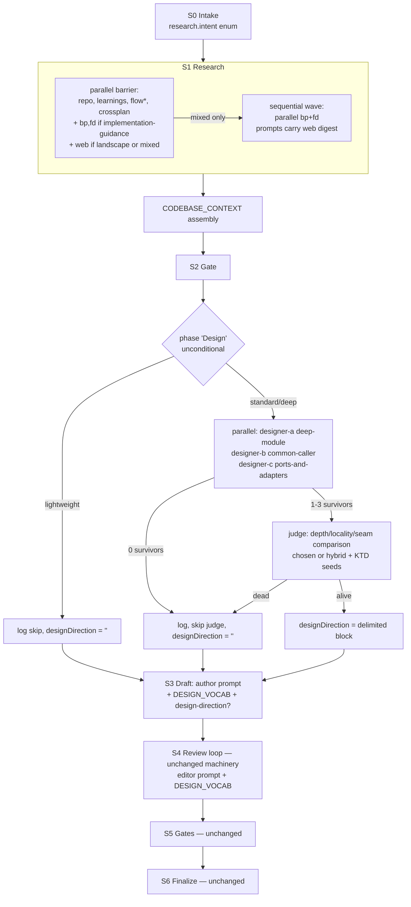

## Summary
Refactor `workflows/nadia-plan.js` and its two personas into a planner with interface-design depth: insert a fail-open design-it-twice Design phase (3 opposed designers + 1 judge) between S2 and S3, thread a shared ~10-line design vocabulary through the design/judge/author/editor prompts, re-enable `ce-framework-docs-researcher` behind research-intent routing, and slim every prompt factory to Fable-5 brief steering — paying for the new phase so the coordinator stays at or below v1's 1979 lines, with all deterministic machinery untouched.

## Problem Frame
nadia-plan v1 is mechanically solid but falls short on two diagnosed fronts (origin doc, commit cb81e998): (1) plans carry no interface-design depth — Key Technical Decisions are single-shot by the author and only challenged after the fact, never competitively generated; (2) prompt factories and personas enumerate behaviors rule-by-rule, a built-for-weaker-models style the Fable-5 guide identifies as degrading output on current models. The verification architecture (fresh-context refuters, evidence cross-checks) is explicitly endorsed by that same guidance and is not a target. The KTD machinery encodes observed live failures and is out of bounds while the verdict-referent A/B is pending.

## Requirements

R1. On standard and deep tiers, a Design phase executes between the strategy gate and draft: exactly 3 designer agents dispatch in one parallel wave with opposed constraints — (a) deep-module: minimize the interface, deletion-test every seam; (b) optimize for the most common caller; (c) ports-and-adapters when remote/third-party dependencies exist, otherwise flexibility/extension — followed by exactly 1 judge agent that compares surviving designs by depth, locality, and seam placement and returns a chosen/hybrid design plus KTD seeds, each with rationale and rejected alternatives. On lightweight tier, `phase('Design')` is still recorded in the trace, zero design agents dispatch, and a skip log line is emitted.

R2. The Design phase never halts the run: dead designers are filtered and logged with the surviving count; zero surviving designs skips the judge dispatch entirely with a log; a dead judge logs the loss; in both degraded cases the author prompt contains no design-direction block (no empty `<design-direction></design-direction>` tags) and the run proceeds to Draft.

R3. When the judge returns a result, the author prompt contains one delimited design-direction block carrying the chosen/hybrid design, the KTD seeds, and their rejected alternatives, plus an explicit contract sentence: seeds are the starting KTD set — each must surface as a Key Technical Decision entry or be explicitly acknowledged as refined-away in rationale, never silently dropped.

R4. A single design-vocabulary constant (~10 lines: module / interface / seam / adapter / depth-as-leverage / locality / deletion test / one-adapter-hypothetical-two-adapters-real / interface-is-the-test-surface, using the origin doc's definitions exactly) is interpolated into exactly four prompt surfaces — designer, judge, author (`author-plan`), editor (`editor-r*`) — and into no other prompt factory (in particular not `reviewPrompt`).

R5. `INTAKE_SCHEMA.research` carries a required `intent` enum (`implementation-guidance` | `landscape` | `mixed` | `none`) and dispatch routes on it: implementation-guidance adds best-practices + framework-docs to the parallel roster; landscape adds web only; mixed dispatches web inside the parallel barrier, then best-practices + framework-docs in a second sequential wave whose prompts carry web's digest; none adds no external researcher. `compound-engineering:ce-framework-docs-researcher` dispatches with `model: 'sonnet'`; the stale "not in the verified agent registry" log line (v1 line 469) is gone from the coordinator; `args.externalResearch === false` still suppresses all external research regardless of intent, with the existing log.

R6. Every prompt factory in the coordinator is slimmed to brief steering + schema contract + grounding blocks; restatements of schema-`description` content are cut. Preserved verbatim: the referent-explicit KTD verdict wording, `GATE_AUTHORITY`, the protected-surface rules, the confidence-anchor rubric's five anchors, and all caps language.

R7. `agents/plan-author.md` gains zero-context-implementer framing, module-depth discipline (each unit delivers an interface; few deep units over shallow pass-throughs; deletion test on forwarding units), test strategy by dependency category (in-process / local stand-in / port + adapter / third-party mock, scenarios stated at the unit's interface, never internal state), and design-direction KTD handling per R3 — within ~120% of its current 66 lines, with every existing load-bearing rule preserved (U-ID/R-ID permanence, vertical slices, no horizontal layering, contract-first units, risk-early ordering, oversized-unit signals, observable verification, scope-boundaries discipline, assumptions-carry-invalidating-observations, evidence-fields honesty).

R8. `agents/plan-editor.md` gains three diagnostics — shallow units (interface as complex as implementation; pass-throughs failing the deletion test), test scenarios aimed past a unit's interface, and KTD rationale missing rejected alternatives when a design-direction existed — within ~120% of its current 46 lines, with the verdict-correctness framing ("judged on VERDICT CORRECTNESS … unnecessary rewrite is a failure") preserved verbatim.

R9. The `meta` export's description, whenToUse, and phases array reflect the Design phase (8 phases: Intake, Research, Gate, Design, Draft, Review, Gates, Finalize); every `phase()` title matches meta exactly; the coordinator's final line count is ≤ 1979.

R10. `node --test workflows/nadia-plan.test.mjs` passes in full, including new pins for: 3 designers + 1 judge on standard/deep; zero design dispatches + skip log on lightweight; design-direction present in the author prompt when the judge survives and absent when it dies; all-dead designers skip the judge; framework-docs dispatch on implementation-guidance, absent on landscape, sequenced after web on mixed; stale registry log absent; vocabulary block present in designer/judge/author/editor prompts. Existing assertions pinning now-slimmed prompt prose are converted to mechanism assertions (block presence, schema fields, dispatch counts, ordering); verbatim-preserved surfaces keep exact-string pins.

R11. All coordinator contract gates hold: `node --check workflows/nadia-plan.js` passes; `meta` is the first statement as a pure literal; no `Date.now()` / `Math.random()` / bare `new Date()`; no coordinator I/O; throws only in the preflight zone; every terminal path returns the structured run summary; the run-summary shape gains no fields and the args contract gains no args.

## Key Technical Decisions

- **Designers and judge inherit the session model (no `model:` pin); the framework-docs researcher is pinned `model: 'sonnet'`.** The model-tier-routing rubric (docs/solutions/architecture-patterns/model-tier-routing-by-ambiguity-and-size.md, 26-dispatch A/B) grades open design decisions 7.5/8 on the top tier vs 4.5/8 on the bottom; competitive design generation and depth/locality judging are exactly that dispatch class. Rejected: `model: 'sonnet'` (empirically undersized for the role); an explicit `'opus'` pin (the session model is already planning-tier by operating convention; a pin would override the operator's session choice). Framework-docs fetching/extraction is grunt work — sonnet, like the rest of the research roster.
- **`mixed` intent uses a second sequential `await parallel([bp, fd])` whose thunks close over web's digest — not a literal `pipeline()` call and not flat-roster inclusion.** `pipeline()` in this runtime is parallel-by-item (test harness, nadia-plan.test.mjs:34), so it cannot express "web first, then bp+fd"; flat-roster inclusion loses the ordering guarantee entirely. Both awaits complete before `CODEBASE_CONTEXT` assembly, so the existing barrier justification comment stays true and no new barrier is added — satisfying origin R7's "pipeline continuation (no added barrier)" intent. Rejected: literal `pipeline([bp, fd], …)` (wrong primitive semantics); nesting the continuation inside the outer `parallel()` (an added barrier).
- **`RESEARCH_CAP` stays 6 and guards only the parallel roster; the mixed continuation is a fixed 2-agent wave logged explicitly as outside the cap.** The cap exists to bound fan-out, and the continuation is constant-size by construction. Rejected: extending the cap arithmetic across both waves (complicates the guard to police a constant), silently leaving the continuation uncapped (violates no-silent-caps).
- **`INTAKE_SCHEMA.research` replaces the `bestPractices`/`web` booleans with the required `intent` enum (`required: ['intent', 'reason']`).** Two routing signals can diverge, and dead required fields are exactly the ceremony this refactor removes. Rejected: keeping the booleans alongside `intent` (divergence risk; routing code reading two sources). Cost: every test fixture supplying `research` updates in the same unit (default `INTAKE()` fixture gets `intent: 'none'`).
- **`phase('Design')` is called unconditionally; only agent dispatch is tier-guarded.** Keeps `trace.phases` identical across tiers, so one phase-sequence pin covers all runs and R9's titles-match-meta holds. Rejected: `phase()` inside the tier guard (lightweight runs would produce a 7-phase trace and break the pin).
- **`designDirection` renders via the `ADJUSTED_FRAMING` ternary idiom (nadia-plan.js:618-634, 701): empty string ⇒ no block at all.** Rejected: unconditional interpolation (leaks empty delimiter tags into the author prompt as noise).
- **KTD seeds stay upstream input only; no coordinator-side seed tracking.** The classify agent keeps extracting KTDs from the written document, and refutation targets those — refined KTDs are refuted in their refined form, which is correct. Enforcement of "no silent drop" is layered without new machinery: the author-prompt contract sentence (preventive), the editor's missing-rejected-alternatives diagnostic (post-hoc — evaluable because `designDirection` is threaded into `editorPrompt` via the `ADJUSTED_FRAMING` ternary, giving the editor the referent it needs), and the existing `ktd-rationale-present` releasability gate (defense-in-depth). Rejected: a coordinator-side seed-vs-document reconciliation check (new machinery inside the explicitly out-of-bounds KTD territory).
- **Unit ordering puts intent routing and the Design phase before prompt slimming; slimming lands last among coordinator units and settles the line budget.** The riskiest semantics (routing restructure, new phase data flow, fail-open branches) get the earliest legitimate waves; the budget is only measurable once the additions exist. The coordinator may temporarily exceed 1979 lines between U3 and U4 — the cap is a final-state success criterion, not a per-commit one. Rejected: slim-first (delays the riskiest units to buy headroom that is predictably recoverable from ~15 prompt factories of ceremony).
- **One `DESIGN_VOCAB` const, four interpolation sites, `reviewPrompt` excluded.** Adding it to `reviewPrompt` would inject ~10 lines × 7 personas × persona rounds of prompt bloat with no functional purpose, against R6's slimming goal. The R10 vocabulary pin therefore asserts presence on the four named labels only — reviewer absence is the desired behavior.
- **`mixed` with a dead web researcher still dispatches the continuation, with an explicit "(web digest unavailable)" marker and a log.** Fail-open consistency: best-practices/framework-docs coverage survives a recoverable upstream failure. Rejected: skipping the continuation (loses guidance coverage); silent empty-string interpolation (silent degradation).

## High-Level Technical Design

`DESIGN_VOCAB` is one shared const consumed by the three designer prompts, the judge prompt, the author prompt, and the editor prompt factory — the four surfaces that must speak the same interface-design language.

## Implementation Units

### U1. Research-intent routing and framework-docs re-enablement
**Goal**: S1 dispatch is driven by an intake-classified research intent, with `ce-framework-docs-researcher` back in the roster and the stale registry log gone.
**Requirements**: R5, R10, R11
**Dependencies**: none
**Files**: `workflows/nadia-plan.js`, `workflows/nadia-plan.test.mjs`
**Approach**: Replace `INTAKE_SCHEMA.research`'s `bestPractices`/`web` booleans with a required `intent` enum plus `reason`; teach the intake prompt the ce-plan routing semantics in one brief-steering sentence (implementation-guidance = approach settled, fetch best practices and version-specific framework docs; landscape = option set unsettled, web scan; mixed = landscape first, then guidance against the shortlist; none = local patterns suffice). Delete the stale log at v1 line 469. Route the roster on intent: implementation-guidance pushes `bp` and a new `fd` entry (`label: 'research-framework-docs'`, `agentType: 'compound-engineering:ce-framework-docs-researcher'`, `model: 'sonnet'`, `DIGEST_SCHEMA`); landscape pushes `web`; mixed pushes `web` into the parallel roster, then — after the barrier resolves — awaits a second `parallel()` of `bp`+`fd` thunks closing over `web.digest` (or an explicit "(web digest unavailable)" marker plus log when web died); none pushes neither. Keep the `EXTERNAL_RESEARCH === false` gate wrapping all of it. Update the `RESEARCH_CAP` comment and add the continuation's outside-the-cap log. Surface the fd digest in `CODEBASE_CONTEXT` alongside best-practices/web. Test side: update the default `INTAKE()` fixture to `intent: 'none'`, migrate the S12/S13 research fixtures and assertions to intent-driven shapes, invert the two stale-log assertions (test lines 227, 497) to absence checks, register the `research-framework-docs` label in `makeDispatcher`, and add the R10 routing pins. This unit leads because the schema migration and the two-wave dispatch restructure are the highest-blast-radius S1 changes — every downstream fixture rides on them.
**Patterns to follow**: roster-of-thunks construction at `workflows/nadia-plan.js:475-548`; skip-vs-failure logging distinction at `:494-561`; fixture/dispatcher conventions in `workflows/nadia-plan.test.mjs` (`INTAKE()` at :72-101, `makeDispatcher` label routing at :150-185).
**Test scenarios**:
- Intake returning `intent: 'implementation-guidance'` produces dispatches labeled `research-best-practices` and `research-framework-docs`, and no `research-web` dispatch.
- Intake returning `intent: 'landscape'` produces a `research-web` dispatch and neither `research-best-practices` nor `research-framework-docs`.
- Intake returning `intent: 'mixed'` dispatches `research-web` strictly before `research-best-practices`/`research-framework-docs` (call-order in the trace), and both continuation prompts contain web's digest text.
- Intake returning `intent: 'mixed'` with a dead web researcher still dispatches the continuation pair, their prompts carry the unavailability marker (not `undefined`), and a log records the missing digest.
- `intent: 'none'` dispatches no external researcher; `externalResearch: false` suppresses all external research for every intent value, with the existing log.
- No log line matching `not in the verified agent registry` appears on any run.
- A run with `intent: 'mixed'` emits the continuation's outside-the-cap log (no silent fan-out beyond `RESEARCH_CAP`).
**Verification**: full suite green via `node --test workflows/nadia-plan.test.mjs`; `node --check workflows/nadia-plan.js` passes; the trace pins above hold; grep finds no occurrence of the stale registry-log string in the coordinator.

### U2. DESIGN_VOCAB shared-vocabulary contract
**Goal**: One ~10-line design-vocabulary constant exists and reaches the author and editor prompt surfaces, pinned by mechanism tests.
**Requirements**: R4, R10
**Dependencies**: U1
**Files**: `workflows/nadia-plan.js`, `workflows/nadia-plan.test.mjs`
**Approach**: Define `DESIGN_VOCAB` near the other locked prompt blocks (sibling to `ANCHOR_RUBRIC` at `workflows/nadia-plan.js:808-816`) carrying the origin doc's definitions exactly: module, interface (everything a caller must know), seam, adapter, depth-as-leverage, locality, deletion test, one-adapter-hypothetical / two-adapters-real, interface-is-the-test-surface. Interpolate it into the author prompt (`:700-731`) and the `editorPrompt` factory (`:944`). Do not touch `reviewPrompt` or any other factory. Designer/judge consumption arrives with U3. Choose a distinctive sentinel phrase (e.g. the deletion-test sentence) for the test pins. Test side: pin presence of the sentinel in the `author-plan` prompt and the `editor-r1` prompt, and absence in every `review-*` persona prompt.
**Patterns to follow**: locked shared prompt blocks (`ANCHOR_RUBRIC`, `GATE_AUTHORITY`) as single consts interpolated by factories; prompt-content pins via `trace.calls.find(...).prompt.includes(...)` as used throughout `workflows/nadia-plan.test.mjs`.
**Test scenarios**:
- The author prompt and the round-1 editor prompt each contain the vocabulary sentinel.
- No review-persona prompt contains the sentinel (the exclusion is the tested behavior, not an accident).
- The S13 no-claim-passing scan still passes (no unresolved interpolation introduced by the new block).
**Verification**: suite green; the presence/absence pins above hold against the dispatch trace.

### U3. Design phase: 3 opposed designers, 1 judge, fail-open threading into the author
**Goal**: A tier-gated, fail-open Design phase between Gate and Draft whose judge output reaches the author as a delimited design-direction block.
**Requirements**: R1, R2, R3, R4, R9, R10, R11
**Dependencies**: U2
**Files**: `workflows/nadia-plan.js`, `workflows/nadia-plan.test.mjs`
**Approach**: Add two schemas: `DESIGNER_SCHEMA` (proposed interface and seam placement, depth/locality self-assessment, rationale) and `DESIGN_JUDGE_SCHEMA` (direction prose for the chosen/hybrid design; `ktdSeeds` array of decision + rationale + rejected alternatives; comparison summary). Insert `phase('Design')` unconditionally after S2's strategy resolution; inside a `DEPTH !== 'lightweight'` guard, dispatch `parallel()` over three designer prompts (labels `design-a`/`design-b`/`design-c`) sharing `CONFIRMED_INTENT` + `ADJUSTED_FRAMING` + `CODEBASE_CONTEXT` + `DESIGN_VOCAB`, each carrying exactly one opposed constraint from R1; no `model:` pin on designers or judge. Filter nulls and log the survivor count; zero survivors logs and skips the judge; otherwise dispatch the judge (label `design-judge`) over the surviving proposals with the depth/locality/seam-placement comparison brief — one opinionated recommendation, hybrid allowed, every seed carrying rationale and rejected alternatives. A dead judge logs and leaves `designDirection = ''`. Lightweight logs the skip and leaves `designDirection = ''`. Render into the author prompt via the `ADJUSTED_FRAMING` ternary idiom, with the R3 contract sentence (seeds are the starting KTD set; refine allowed; silent drops forbidden; rejected alternatives carried into rationale) inside the block. Also thread `designDirection` into `editorPrompt` via the same `ADJUSTED_FRAMING` ternary idiom: when `designDirection` is non-empty, interpolate it into the editor prompt so the "missing rejected alternatives when a design-direction existed" diagnostic (added in U6) has an evaluable referent; when `designDirection` is empty, no block is injected (matching the author's behavior). Update `meta`: insert the Design phase entry between Gate and Draft, and mention design-it-twice in description/whenToUse. Test side: handle the four new labels in `makeDispatcher` (unhandled labels hard-throw); update the phase-sequence `deepEqual` (test line 226) to the 8-phase array; add the R10 pins listed below, making sure the fail-open tests exercise the real branches per docs/solutions/best-practices/verification-scripts-need-sanity-checks.md (assert the judge is NOT dispatched on all-dead designers, and assert the run still reaches Finalize with a completed summary — not merely "no crash"). The `design-judge` fixture in `makeDispatcher` must return a `direction` field containing the sentinel string `'JUDGE_DIRECTION_SENTINEL'` and a non-empty `ktdSeeds` array; the data-flow pin then asserts `trace.calls.find(c => c.label === 'author-plan').prompt.includes('JUDGE_DIRECTION_SENTINEL')`, making the check non-vacuous. Recalibrate the three S11 `budgetTotal` values (test lines 466, 473, 477) to account for 4 additional design-phase dispatches (40 000 units at 10 000/call, using the standard-tier default fixture): the previous calibration assumed no design phase; each sub-case must still trip its intended floor boundary (round-2 head, S5 entry, S6 entry). The 110 000 case at test line ~960 (S4 budget-floor, `roundsUsed 0`) is unaffected because it fires before the Design phase runs and needs no change.
**Execution note**: The coordinator may exceed 1979 lines at the end of this unit; U4 settles the budget. The suite must still be green here.
**Patterns to follow**: fail-open dead-agent handling at `workflows/nadia-plan.js:619-621` (strategy gate); conditional block rendering at `:618-634` and `:701` (`ADJUSTED_FRAMING`); tier-guarded dispatch with skip log at `:522-533` (flow research); schema style of `STRATEGY_SCHEMA`/`CLASSIFY_SCHEMA`.
**Test scenarios**:
- A standard-tier run dispatches exactly 3 `design-*` agents and 1 `design-judge`; a deep-tier run likewise; trace phases equal the 8-phase sequence including 'Design'.
- A lightweight-tier run records `phase('Design')` in the trace, dispatches zero design-phase agents, and emits the skip log — and the 8-phase sequence pin still passes.
- Judge alive: the `author-plan` prompt contains the design-direction delimiter AND the string `'JUDGE_DIRECTION_SENTINEL'` (the judge fixture's `direction` value — data-flow pin proving the judge's actual return value reached the prompt, not just an empty tag); the contract sentence about KTD seeds is present inside the block.
- Judge dead (dispatcher returns null for `design-judge`): a loss log appears, the author prompt contains no design-direction delimiter at all (no empty tags), and the run completes to a non-halted summary.
- All three designers dead: no `design-judge` dispatch appears in the trace, a loss log appears, and the run completes — the Design phase produces no halt summary on any degraded path.
- One or two designers dead: the judge still dispatches, and its prompt contains only the surviving proposals.
- Designer and judge prompts contain the `DESIGN_VOCAB` sentinel; designer/judge dispatch options carry no `model` field.
- The S13 no-claim-passing scan passes over the new design/judge prompts (no `undefined` / `[object Object]` / bare `${`).
- S11 budget-floor values updated to account for 4 additional design-phase dispatches (40 000 units at 10 000/call); all three `budgetTotal` cases (test lines 466, 473, 477) still exercise the correct floor boundaries (round-2 head, S5 entry, S6 entry).
- Editor-side design-direction threading (R10): when the judge survives (standard-tier, healthy judge fixture), the `editor-r1` prompt contains the `'JUDGE_DIRECTION_SENTINEL'` string (proving the design-direction block reached the editor); when the judge is dead or the tier is lightweight, the `editor-r1` prompt contains no design-direction delimiter.
**Verification**: full suite green including S11 with recalibrated `budgetTotal` values; `node --check` passes; `meta` phases array has 8 entries with titles matching every `phase()` call; the run summary on design-degraded paths is shape-identical to v1's (no new fields).

### U4. Prompt-factory slimming, mechanism-pin conversion, and line-budget settlement
**Goal**: Every coordinator prompt factory is Fable-5 brief steering with verbatim surfaces intact, and the coordinator closes at ≤ 1979 lines.
**Requirements**: R6, R9, R10, R11
**Dependencies**: U3
**Files**: `workflows/nadia-plan.js`, `workflows/nadia-plan.test.mjs`
**Approach**: Before slimming the review and fixer factories, add exact-string pins for the `ANCHOR_RUBRIC` five anchor lines and the fixer's caps language (the PROTECTED SURFACES sentence and the NEVER-renumber sentence) so the suite fails if slimming erodes them. Then pass over every prompt factory (intake, research roster, strategy, author, `reviewPrompt`, `refutePrompt`, `ktdRefutePrompt`, `ktdArbitrationPrompt`, `fixerPrompt`, `checkerPrompt`, `refixUidPrompt`, `editorPrompt`, `spikePrompt`, `reviseSpikePrompt`, `parsePlanPrompt`, `parseFixPrompt`, `releasabilityPrompt`, `originCoveragePrompt`, `gateFixPrompt`) collapsing enumerated micro-rules into single steering sentences and deleting restatements of fields already carried by schema `description`s. Hard-preserve verbatim: the referent-explicit KTD verdict wording (schema descriptions at `:210`, `:222` and the refuter/arbiter prompt sentences at `:872-875`), `GATE_AUTHORITY` (`:1711`), protected-surface rules, the `ANCHOR_RUBRIC` anchors (`:808-816`), and all caps language. Do not alter any schema shape, gate predicate, or loop structure — prose only. Convert the remaining test assertions that pin slimmed prose into mechanism pins (block presence, schema-field presence, dispatch counts, call ordering); keep exact-string pins for every verbatim-preserved surface so a future slimming pass cannot silently erode them. Close by confirming the line count: final coordinator ≤ 1979 lines.
**Patterns to follow**: the origin doc's distilled Fable-5 principles (docs/brainstorms/2026-06-11-nadia-plan-v2-requirements.md, "Distilled Source Principles") — brief steering, remove instructions where default model behavior is better; ce-plan prose economy (one idea per sentence, precision is not padding).
**Test scenarios**:
- Exact-string pins hold for: KTD verdict referent wording, `GATE_AUTHORITY` text, all five `ANCHOR_RUBRIC` anchor lines (added before slimming begins), the fixer's PROTECTED SURFACES sentence (added before slimming begins), and the fixer's NEVER-renumber sentence (added before slimming begins) — proving the verbatim surfaces survived slimming byte-identically.
- No remaining assertion fails because it pinned a slimmed sentence; converted pins assert mechanisms (e.g. primer block present, schema contract referenced, fix/check ordering) and the full suite is green.
- All halt paths, gate flows, and the KTD arbitration scenarios (S8, S22, and siblings) pass unchanged — demonstrating slimming touched prose, not machinery.
**Verification**: `wc -l workflows/nadia-plan.js` ≤ 1979; `node --check` passes; full suite green; grep confirms zero banned forms (`Date.now(`, `Math.random(`, bare `new Date()`) and no I/O calls in the coordinator; `meta` remains the first statement as a pure literal.

### U5. plan-author persona: zero-context-implementer framing and module-depth discipline
**Goal**: `agents/plan-author.md` produces interface-deep plans while preserving every v1 load-bearing rule.
**Requirements**: R7
**Dependencies**: U3
**Files**: `agents/plan-author.md`
**Approach**: Rework the persona in brief-steering style: open with the zero-context-implementer frame (write for a skilled engineer with zero codebase context and questionable test-design taste — the plan supplies both). Add module-depth discipline to the decomposition section: each unit delivers an interface, not a layer; prefer few deep units over shallow pass-throughs; apply the deletion test to any unit that mostly forwards. Add dependency-category test strategy to the content section: in-process dependencies are tested through the interface directly, local-substitutable via a stand-in in the suite, remote-but-owned via port + in-memory adapter, true-external via injected mock — and test scenarios are stated at the unit's interface, never against internal state. Add design-direction handling: when the brief carries a design-direction block, its KTD seeds are the starting Key Technical Decisions — refine freely, never silently drop, carry rejected alternatives into rationale. Preserve (verbatim or semantically identical) all load-bearing rules enumerated in R7; pay for additions by condensing existing prescriptive prose, staying within ~80 lines.
**Patterns to follow**: the existing persona's frontmatter + imperative-sections structure (`agents/plan-author.md`); vocabulary terms exactly as defined in the origin doc / `DESIGN_VOCAB`.
**Test scenarios**:
- A side-by-side diff against v1 shows every R7 load-bearing rule still present (each traceable to a sentence), and the four new disciplines present.
- The file stays within ~80 lines and parses as valid agent frontmatter (name, description, tools unchanged in semantics: still writes exactly one file).
- No rule contradicts the coordinator's author prompt contract from U3 (seeds handling described identically in both).
**Verification**: a reviewer can map all R7-listed rules to surviving text; line count ≤ ~80; no other file modified.

### U6. plan-editor persona: three interface-design diagnostics
**Goal**: `agents/plan-editor.md` detects shallow units, past-interface tests, and missing rejected alternatives, with its eval-backed verdict framing byte-identical.
**Requirements**: R8
**Dependencies**: U3
**Files**: `agents/plan-editor.md`
**Approach**: Extend the failure-mode enumeration with three diagnostics: shallow units (a unit's interface as complex as its implementation; pass-through units failing the deletion test); test scenarios that reach past a unit's interface into internal state (the interface is the test surface — testing past it means the unit is the wrong shape); and KTD rationale missing rejected alternatives when the plan was authored under a design-direction (evaluable because U3 threads the design-direction block into `editorPrompt`). Keep the verdict-correctness paragraph ("You are judged on VERDICT CORRECTNESS … An unnecessary rewrite is a failure. Missing a real problem is a failure. READY means … REVISED means …") byte-identical — it is eval-backed. Apply brief-steering condensation elsewhere to stay within ~55 lines.
**Patterns to follow**: the existing diagnostic-list structure in `agents/plan-editor.md:20-34`; vocabulary terms exactly as in `DESIGN_VOCAB`.
**Test scenarios**:
- The verdict-correctness paragraph diffs byte-identical against v1.
- The three new diagnostics appear in the enumeration and use the shared vocabulary terms (deletion test, interface as test surface).
- All v1 diagnostics (wrong problem, false repo assumptions, contract errors, sequencing, oversized units, horizontal slicing, stale/tautological scenarios, hidden design unknowns, assumptions without invalidating observations) survive.
**Verification**: byte-identical framing paragraph confirmed by diff; line count ≤ ~55; no other file modified.

## Scope Boundaries

- `workflows/nadia-deliver.js`, `agents/skeptical-refuter.md`, `agents/finding-verifier.md`, and the S5 gate set: untouched.
- The full KTD machinery (KTD_VERDICT_SCHEMA, KTD_ARBITRATION_SCHEMA, 2-of-3 arbitration, halt allowances, re-refutation pass): no simplification, no collapse — it encodes observed live failures and the verdict-referent A/B is still pending.
- All pure-JS machinery (uidStabilityViolations, fileOverlapViolations, Kahn cycle check, sameFinding paraphrase dedup at 0.8, primer suppression, synthesis merge, halt-class caps, budget-floor guards, `summary()` single merge point, args-as-string acceptance, REPO grounding chokepoint): prose around it may slim; behavior may not change.
- ce-plan document format invariants: PLAN_TEMPLATE, section catalog, frontmatter fields, U-ID/R-ID stability rules, UNITS_SCHEMA as a byte-copy of nadia-deliver's.
- S0–S6 phase structure loses nothing (Design inserts; nothing removed); S5 gates and S6 finalize are unchanged.
- The run-summary shape: no new fields; the args contract: no new args.
- Primer suppression and paraphrase dedup: locked conservative-cut decision, not simplified.

### Deferred to Follow-Up Work
- Playground A/B simulation of the behavior-quality claims (design phase improves plan depth; slimming improves output) per the validating-agent-improvements skill — until it runs, those claims are hypotheses; this plan's deterministic harness proves data-flow only.
- Committing the nadia-plan v1 provenance/design-spec documents currently living only in `/tmp/nadia-plan-build` (ephemeral) into the repo — this refactor changes the mechanisms those documents justify, so preserving them first is strongly advisable but is not part of this plan's file set.
- The KTD verdict-referent A/B (defects 2–3 from the 2026-06-10 E2E) — pending, separate track.
- Any new run-summary fields or workflow args surfacing Design-phase outcomes (the phase's effect is visible in the plan document itself).

## Assumptions

- The 3 designers and the judge run on the inherited session model (no `model:` pin): competitive design generation and depth/locality judging are open-design-decision dispatches per the model-tier-routing rubric, not grunt work — invalidated when: the coordinator's analogous creative/judging stages (author, arbiters) are found pinned to an explicit model, or a repo solutions/doc entry pins design-stage model choice differently.
- "Within roughly its current length" (origin R5) permits ~120% growth: plan-author.md targets ≤ ~80 lines (from 66) and plan-editor.md ≤ ~55 (from 46), paid for by condensing prescriptive prose — invalidated when: the editor loop or the requester states a specific line cap, or preserving every R7/R8 load-bearing rule provably cannot fit within ~120%.
- The research-intent classification is produced by the existing S0 intake agent via a required `intent` enum on `INTAKE_SCHEMA.research` (replacing the booleans); no new agent is added — invalidated when: a downstream consumer of the intake output is found reading `research.bestPractices`/`research.web` outside the S1 routing being rewritten, or a pinned test cannot be migrated, forcing the classification into a separate agent call.
- Origin R7's "pipeline continuation (no added barrier)" means sequential ordering of the bp/framework-docs pair after web resolves — satisfied by a second `await parallel()` whose thunks close over web's digest — not a literal `pipeline()` call, since `pipeline()` in this runtime is parallel-by-item (harness line 34) and cannot express stage ordering for this shape — invalidated when: the origin doc is revised to pin literal `pipeline()` semantics, or the runtime's `pipeline()` is shown to provide per-stage sequencing usable here.
- Prose-pinned test assertions are convertible to mechanism pins (block presence, schema fields, ordering, dispatch counts) except for the verbatim-preserved surfaces, which keep exact-string pins — invalidated when: a prose-pinned assertion turns out to be the only guard for an eval-backed behavior whose mechanism cannot be asserted structurally, requiring that prose to survive slimming.
- Inserting the Design phase does not renumber anything: the phases array gains an entry between Gate and Draft, S0–S6 identifiers stay as comments/labels, and `phase()` titles match meta — invalidated when: inspection shows phase identifiers are positional (array-index-coupled) in tests or the run summary, making a non-renumbering insert impossible without touching the invariant run-summary shape.
- Slimming ~19 prompt factories recovers at least the ~120–180 lines the Design phase adds, keeping the final coordinator ≤ 1979 lines — invalidated when: after slimming every factory while preserving all verbatim surfaces, the coordinator still exceeds 1979 lines with the Design phase in place.

## Open Questions

- **v1 provenance docs live only in /tmp — deferral carries no ordering guarantee.** The plan rewrites and slims the very mechanisms whose selection rationale exists only in an ephemeral `/tmp/nadia-plan-build` directory. The domain memory explicitly recommends committing those documents before changing mechanisms; the Deferred section names this as strongly advisable. A reboot or tmp cleanup before implementation begins will destroy institutional memory for decisions (primer suppression thresholds, dedup rationale, halt-allowance calibrations) that this refactor's slimming pass must preserve. No ordering guarantee exists between the deferral and any of U1–U4 starting. Resolution: confirm whether `/tmp/nadia-plan-build` still exists and commit its contents, or explicitly accept that the provenance is lost and document which mechanism invariants must be read from the coordinator itself.

- **U2 dependency on U1 appears to be sequencing preference, not a structural requirement.** U2 modifies a shared constant (`DESIGN_VOCAB`) and two prompt factories (author, editor) entirely independent of the `INTAKE_SCHEMA.research` enum migration and S1 routing restructure that U1 performs. The U1 test-harness changes (updating the default `INTAKE()` fixture and dispatcher) are needed before U3 (which dispatches new design-phase labels), but U2's prompt-constant work does not read or write S1 artifacts. If U2 is a structural dependency of U1 this should be named; if it is only sequencing preference it can run in parallel with or after U1, unblocking U3 sooner. Resolution: confirm whether U2 must follow U1 for a technical reason (e.g. a merge conflict risk or a fixture update that U1 lands that U2's tests depend on) or reorder the dependency to U2 → none with U3 → U1 and U2.

- **R5 dispatches `compound-engineering:ce-framework-docs-researcher` but the plan's U1 labels it `research-framework-docs`; terminology drift risks dispatcher mismatch.** The coordinator dispatches agents via labels (e.g. `label: 'research-framework-docs'`), not via their skill ID. If any test fixture, downstream code, or documentation searches for the skill name `'compound-engineering:ce-framework-docs-researcher'` when expecting the dispatch label `'research-framework-docs'`, the lookup will silently fail to match. Implementers must keep the two namespaces distinct: the label is the trace key; the skill ID is in `agentType`. Resolution: confirm, before finalising U1 fixtures, that `makeDispatcher` registers the entry under the trace label `'research-framework-docs'`, and that all test assertions query `trace.calls` by that label — never by the skill ID.

- **U1 references two test assertions to invert (lines 227 and 497) but only the S1 assertion is enumerated in test scenarios; the S12 assertion at line 497 is implicit.** Implementers updating the stale-log assertion at line 227 (S1) may overlook the corresponding assertion at line 497 (S12). A silently non-inverted S12 assertion would leave a stale forwards check in the suite that either passes vacuously or fails for the wrong reason. Resolution: U1's test scenarios must explicitly name both assertions — line 227 (S1 path) and line 497 (S12 path) — as targets for inversion to absence checks, so neither is missed.

- **U3 test scenario at line 124 asserts "no judge dispatch appears in the trace" for all-dead designers, but does not specify how to verify this absence.** The test harness records all dispatches in `trace.calls`. A reliable absence assertion (per docs/solutions/best-practices/verification-scripts-need-sanity-checks.md) must be explicit and non-vacuous. Resolution: U3's all-dead-designers scenario must assert `!trace.calls.some(c => c.label === 'design-judge')` — checking the `trace.calls` array by label — rather than leaving the absence condition unspecified.

- **R10 test pin for "stale registry log absent" does not name the assertion location or expected absence pattern.** Without specifying location and method the test scenario is ambiguous. The current S1 test at line 227 checks `trace.logs.some((m) => /ce-framework-docs-researcher/.test(m))` — the same pattern used for presence. Resolution: U1 must explicitly record that the assertion at line 227 is inverted to `!trace.logs.some((m) => /not in the verified agent registry/.test(m))` (or the exact stale-log substring), and that the line 497 counterpart is inverted identically, so both become unambiguous absence checks.

- **Open Question 2's proposed reorder (U2 depends on nothing) would place U1 and U2 in parallel, but both own the same files — `workflows/nadia-plan.js` and `workflows/nadia-plan.test.mjs`.** The plan format's own `fileOverlapViolations` invariant (listed as untouched in Scope Boundaries) and the `plan-author.md` rule ("no file may be owned by two units unless a Dependencies path connects them") make a true parallel ordering of U1 and U2 a format violation. Resolution: if U2 is reordered to depend on nothing, its `Files` entry must be changed to reflect only the files it exclusively modifies — or the dependency must remain U2 → U1 to satisfy the overlap invariant.

- **U3's approach and verification gate omit the S11 budget-floor recalibration that the plan's own arithmetic proves is required for U3 to go green.** Resolved: folded into U3's Approach and test scenarios above (S11 budget-floor recalibration is now an explicit U3 deliverable). Retained here for audit trail.

## Deferred to Implementation

- Exact label strings for the design agents (`design-a`/`design-b`/`design-c`/`design-judge` or equivalent) and the sentinel phrase used for vocabulary-presence pins. (Note: the judge fixture's `direction` sentinel is pinned as `'JUDGE_DIRECTION_SENTINEL'` in U3's Approach and test scenarios — no longer deferred for that specific value.)
- Exact placement of the framework-docs digest line within the `CODEBASE_CONTEXT` block.
- Precise wording of slimmed prompt sentences (bounded by R6's verbatim-preservation list and the schema contracts).
- Field-level naming inside `DESIGNER_SCHEMA`/`DESIGN_JUDGE_SCHEMA` (bounded by the R1/R3 content requirements: depth/locality/seam comparison, seeds with rationale and rejected alternatives).
- Which existing test scenarios absorb the new pins versus how many new `S(...)` scenarios are added.

## Risks & Dependencies

- **Line budget (R9) is the binding constraint.** The Design phase costs ~120–180 coordinator lines (2 schemas, 4 prompts, fail-open guards); slimming must pay for all of it. Mitigation: budget settles in U4 with an explicit `wc -l` verification; the assumption above names the failure observation; if it fires, the fallback is deeper slimming of the largest factories (author, parse, releasability) — never touching machinery.
- **Verbatim-surface regression during slimming.** Eval-backed wording (KTD verdict referent, editor framing, anchors, GATE_AUTHORITY) silently eroding would undo measured wins. Mitigation: U4 and U6 keep exact-string test pins for every verbatim surface, so erosion fails the suite, not just review.
- **False-green fail-open tests.** Past harness work produced two false-verdict bugs (docs/solutions/best-practices/verification-scripts-need-sanity-checks.md). Mitigation baked into U3's scenarios: the all-dead path must assert the judge was NOT dispatched and the run completed; the data-flow pin must assert judge-content substrings in the author prompt, not bare delimiter presence.
- **Downstream consumer (nadia-deliver) reads these plan documents.** The document format and run-summary shape are invariants here, so no nadia-deliver change is needed; plans simply carry richer KTD sections. Any format drift would be caught by the untouched S5 parse gate.
- **Behavior-quality claims are unvalidated until the playground A/B runs** (deferred follow-up). This plan's tests prove mechanism and data flow, by design.

## Acceptance Examples

- Given `depth: 'standard'` and all design agents healthy, when the run reaches Draft, then the trace shows 3 `design-*` dispatches + 1 `design-judge`, and the `author-plan` prompt contains the design-direction block with the judge's direction text and KTD seeds.
- Given `depth: 'lightweight'`, when the run executes, then `trace.phases` still contains 'Design', zero design agents dispatched, and a skip log exists.
- Given intake `intent: 'implementation-guidance'`, then `research-framework-docs` and `research-best-practices` dispatch and `research-web` does not; given `intent: 'landscape'`, the reverse; given `intent: 'mixed'`, web completes before the bp/fd pair dispatches and both their prompts embed web's digest; given `intent: 'none'`, no external researcher dispatches.
- Given all 3 designers return null, then no judge dispatch occurs, a loss log exists, the author prompt has no design-direction tags, and the run returns a completed (non-halted) summary.

## Sources / Research

- Origin: docs/brainstorms/2026-06-11-nadia-plan-v2-requirements.md (cb81e998) — requirements R1–R11, invariants, distilled Fable-5 / mattpocock / trycycle / ce-plan principles.
- docs/solutions/architecture-patterns/model-tier-routing-by-ambiguity-and-size.md — 26-dispatch A/B grounding the no-model-pin decision for designers/judge and sonnet for the framework-docs researcher.
- docs/solutions/best-practices/verification-scripts-need-sanity-checks.md — false-verdict harness bugs grounding U3's fail-open test discipline.
- v1 ground truth read for this plan: `workflows/nadia-plan.js` (1979 lines; stale log at :469, ADJUSTED_FRAMING idiom :618-634/:701, prompt factories :823-1845), `workflows/nadia-plan.test.mjs` (phase pin :226, stale-log pins :227/:497, research pins :500-538), `agents/plan-author.md` (66 lines), `agents/plan-editor.md` (46 lines).
